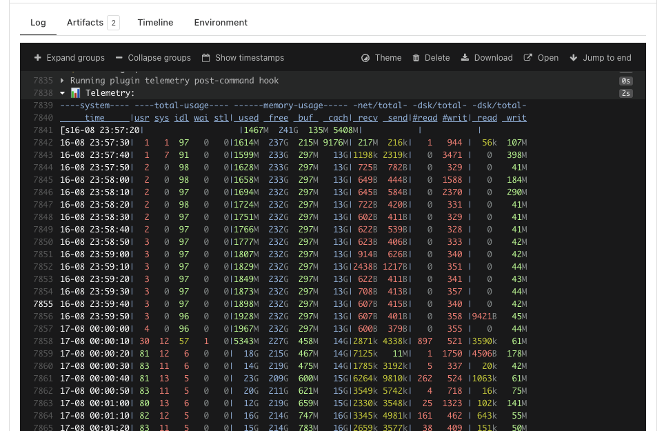

# Buildkite Job Telemetry Reporter



Capture and report telemetry (CPU/memory/disk/network) from Buildkite jobs.

Metrics are collected with `dstat` on 10 second intervals and added to the job log
at the end of the job.

## Example

Add the following to your `pipeline.yml`:

```yaml
steps:
  - command: ./run_build.sh
    plugins:
      - planetscale/telemetry#v0.0.7: {}
```

The are no configuration options at this time.

## Developing

To run the linters:

```shell
make lint
```

To run the tests:

```shell
make test
```

## Releases

A new version is automatically released on all main branch merges. We use
[autotag](https://github.com/pantheon-systems/autotag) to generate tags. Autotag
can be configured via commit messages. By default, it will increment the patch
version. To increment the minor or major version, include [minor] or [major] in the
first line of a commit message.

## Contributing

1. Fork the repo
2. Make changes
3. Run the tests
4. Commit and push your changes
5. Send a pull request

## TODO

This should be rewritten as a standalone app with a nicer summary and graphs attached
to the job via `buildkite-agent annotate`. For now, the 10-second interval output of
`dstat` is good enough.

Inspiration: https://github.com/catchpoint/workflow-telemetry-action
